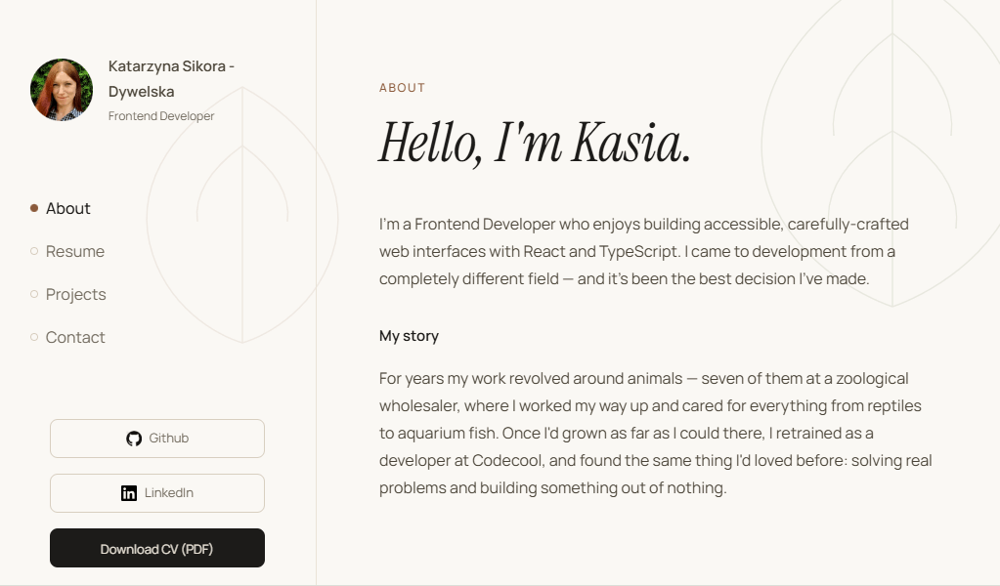
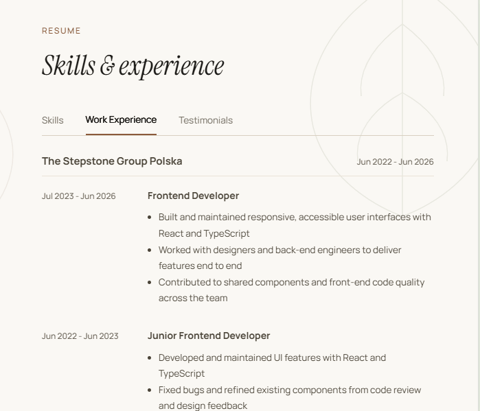
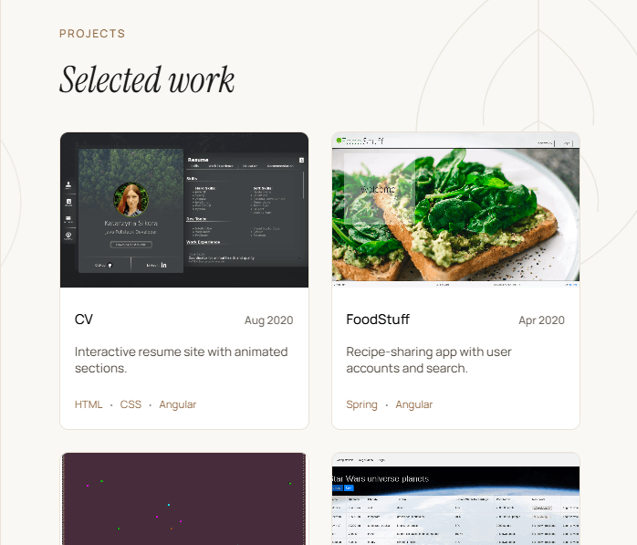
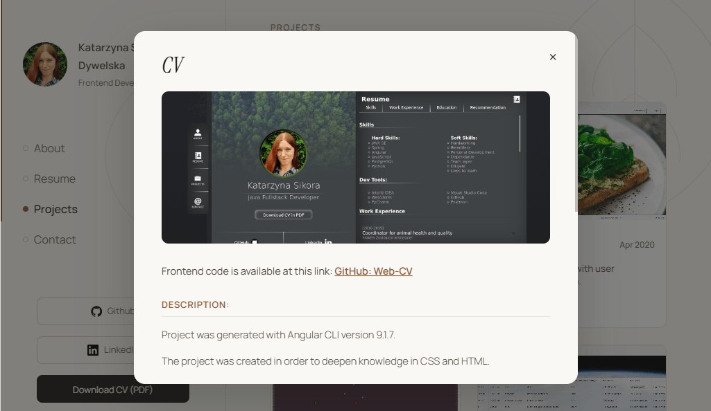
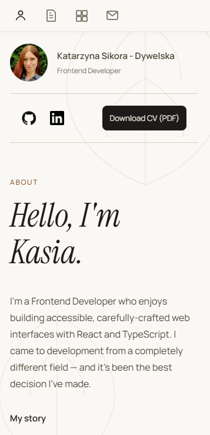

# Web CV — Katarzyna Sikora

A personal CV / portfolio single-page app for **Katarzyna Sikora**, Frontend Developer. Interactive resume with an animated, accessible interface — a nicer way to read a CV than a static PDF.

🔗 **Live:** https://cv-kasiasikoras-projects.vercel.app/



## Features

- **Single-page layout** — About, Resume, Projects, and Contact, with a fixed sidebar on desktop that collapses to a top icon bar on mobile.
- **Scroll-spy navigation** — the active section updates automatically as you scroll (`IntersectionObserver`).
- **Scroll progress bar** along the content edge, and **fade/slide reveal** on sections as they enter and leave the viewport.
- **Tabbed résumé** — Skills, Work Experience, and Education.
- **Project modals** — built on the native `<dialog>` element, so focus-trapping, `Esc` to close, and focus restoration come from the browser. Includes a dedicated grid view for Frontend Mentor challenges.
- **Working contact form** — submissions are relayed to the owner's inbox via [Formspree](https://formspree.io), with inline per-field validation errors and a success state.
- **Accessibility** — built to WCAG 2.1 AA: labelled controls, visible focus rings, `aria-invalid`/`aria-describedby` on form errors, decorative graphics hidden from assistive tech, and all motion gated behind `prefers-reduced-motion`.

## Screenshots

Résumé and Projects:

| Résumé | Projects |
| :---: | :---: |
|  |  |

| Project detail | Mobile |
| :---: | :---: |
|  |  |

## Tech stack

- **React 19** + **TypeScript**, with the **React Compiler** enabled
- **Vite** (build/dev) + **vite-plugin-svgr** (import SVGs as components)
- **SCSS** (`sass-embedded`), mobile-first with a shared breakpoint/mixin partial
- **ESLint** (typescript-eslint + react-hooks)

## Getting started

```bash
npm install
npm run dev      # start the dev server (Vite)
```

### Environment

The contact form needs a Formspree endpoint. Create a `.env` in the project root (it's git-ignored):

```
VITE_FORM_URL=https://formspree.io/f/your-form-id
```

Get the ID by creating a form at [formspree.io](https://formspree.io). Without it, the site runs but the contact form won't submit.

### Scripts

| Command | Description |
|---|---|
| `npm run dev` | Start the Vite dev server with HMR |
| `npm run build` | Type-check (`tsc -b`) and build for production |
| `npm run preview` | Preview the production build locally |
| `npm run lint` | Run ESLint |

## Project structure

```
src/
├─ components/
│  ├─ SideBar / About / Resume / Projects / Contact   # main sections
│  ├─ Modal                                           # native <dialog> wrapper
│  ├─ ResumeContent/                                  # skills, experience, education, tabs
│  └─ ProjectsContent/                                # per-project modal content + data
├─ hooks/            # useActiveSection (scroll-spy), useInView (reveal)
├─ styles/           # _mixins.scss (breakpoints + shared mixins)
├─ assets/           # images and SVG icons
├─ App.tsx
└─ index.scss        # design tokens (CSS custom properties) + globals
```

## Deployment

It's a static SPA, so any static host works (Vercel, Netlify, GitHub Pages, …):

```bash
npm run build        # outputs to dist/
```

Deploy the `dist/` folder, and set `VITE_FORM_URL` as an environment variable in your host's build settings.
